Cloud Resume ChallengeThis project documents my end-to-end process of building and deploying a production-grade personal resume website on Google Cloud, leveraging AI as a copilot. The entire process was completed in approximately 5 hours over three days.Cloud Resume ArchitectureThis diagram illustrates the secure, scalable, and globally available deployment I built for cloudresume.thecammiller.com.

```mermaid
graph TD
    %% Define the primary styles for the diagram
    classDef main-node fill:#2c3e50,stroke:#2c3e50,stroke-width:2px,color:#f4f7f6,font-weight:bold,rx:8px,ry:8px;
    classDef file-node fill:#f4f7f6,stroke:#e67e22,stroke-width:2px,color:#2c3e50,rx:8px,ry:8px,font-weight:bold;
    classDef external fill:#bbf,stroke:#333,stroke-width:2px,color:#2c3e50,rx:8px,ry:8px;
    classDef accent-node fill:#e67e22,stroke:#e67e22,stroke-width:2px,color:#f4f7f6,font-weight:bold,rx:8px,ry:8px;
    classDef log-node fill:#ecf0f1,stroke:#bdc3c7,stroke-width:2px,color:#2c3e50,rx:8px,ry:8px;
    
    %% Define the nodes with custom styling
    A[User's Browser 💻]:::main-node --> B(WPX Domain Registrar)
    B:::external --> C(Cloud DNS Zone)
    C -- NS Delegation --> C
    A -- HTTPS Request --> D(Global HTTPS Load Balancer 🛡️)
    D:::accent-node --> E(Backend Bucket)
    E:::main-node -- Static Website Hosting --> E
    E --> F[index.html]
    E --> G[404.html]
    D -- SSL Certificate Provisioning --> H(Google Managed SSL Cert)
    H:::main-node -- Verified by DNS --> C
    D -- Cache content --> I(Cloud CDN)
    I:::accent-node --> J(Cloud Logging)
    J:::log-node

    %% Subgraph to group Google Cloud components
    subgraph "Google Cloud Platform"
        C
        D
        E
        F:::file-node
        G:::file-node
        H
        I
        J
    end

    %% Hide the arrow from log node for a cleaner look
    linkStyle 9 stroke-width:0px;

```

Key Architectural DecisionsSubdomain Isolation: 
Using cloudresume.thecammiller.com keeps my project isolated from my main WordPress site, a standard enterprise practice that avoids routing complexity and risk.Global HTTPS Load Balancer: This provides critical services like SSL termination, a global anycast IP, and a Google-managed certificate. It's the foundation for any production web service.Cloud CDN at the Edge: Enabled with a single checkbox, Cloud CDN caches my static assets at Google's global network edge, delivering real performance gains and reducing latency for users worldwide.

Built-in Observability: I enabled Cloud Logging from the start to gain crucial visibility into traffic, cache efficiency, and troubleshooting.Strategic AI Usage: I used AI to accelerate boilerplate tasks like drafting the initial HTML, but I owned all architectural decisions, trade-offs, and troubleshooting.Bumps in the RoadNo project is perfect. I used a systematic approach to diagnose and fix these issues:Bucket Returned XML: Instead of serving index.html, my GCS bucket showed an XML directory listing. The Fix: I enabled "Static website hosting" on the bucket, which told it to serve index.html as the default page.

SSL Certificate Stuck in "Provisioning": The Google-managed certificate wouldn't activate. The Fix: I knew this was expected until DNS was pointed correctly. After delegating the subdomain and adding the A record, I waited for DNS propagation, and the certificate activated automatically.

What This Project Demonstrates
This project is a tangible portfolio piece that showcases my ability to:
Design like an architect: I didn't just upload a file; I built a secure, scalable, and observable deployment.
Move fast with AI without outsourcing understanding: I can explain every component and every decision I made.
Troubleshoot systematically: I was able to reproduce, diagnose, fix, and verify solutions using both UI and CLI tools.

